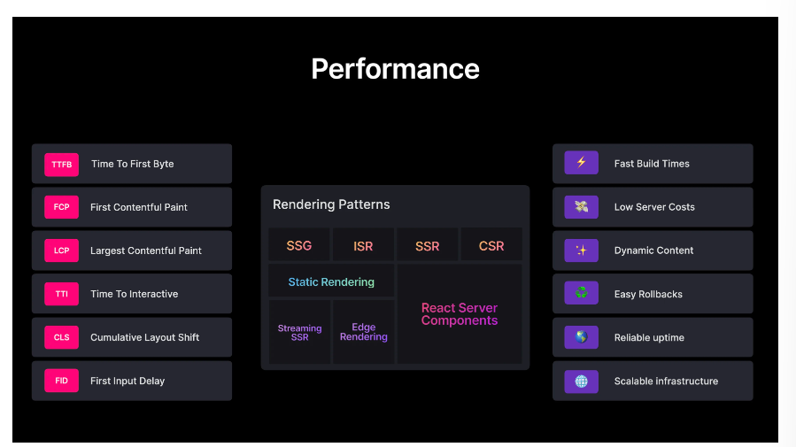

Core Web Vitals

TTFB : (Time to first byte): Time it takes for a client to recieve the byte of 
FCP (First contentful Paint): Time takes the browser to render the first piece of content after navigation
LCP(Largest contentful Paint): Time it takes to load and render the page's main content
TTI (Time to interactive) Time from the page start loading to when it's readiably responding to user input quickly
CLS (Comulative Layout shift) MEasures visual stability to avoid unexpected layout shift
FID (First input delay) Time from when the user interects with the page to the time when the event handlers are able to run

DX(Developers Experience)
UX(User Experience)

Developers Experience : Main focus:
1. Fast build times : The projrct shoulf build fast for quick iteration and deployment
2. Low server costs: The website should limit and optimize the server execution time to reduce execution costs
3. Dynamic Content: The page should be able to load dynamic content performantly
4. Easy Rollbacks : A project deployment can easily be reverted to a previous version
5. Reliable uptime : Users should always be able to visit your website through operational servers.
6. Scalable Infastructure: your project can easily grow or shrink without running into performance issues.

SSR(server side rendering)
CSR(Client side rendering)

1. Static Rendering : Static rendering is a simple and yet powerful pattern you can use to build fast websites with nearly instant page loads

HTML : easily cacheable on a CDN or an edge network.
Basic/Plain Static Rendering

2. Static Rendering with Client-Side fetch

You can still use static rendering for the website to render the UI with a skeleton component where you want to place the dynamic listing data.
While Static Rendering with Client-Side fetch gives us a good TTFB and FCP, the LCP is sub-optimal since “largest content” can only be displayed after we get the listings data from the API route.

3. Static with getStaticProps

This method allow you to the access the data at build time on the server. It can be good solution if you know that the dyanamic data on a static page will always be available at build time.

4. Incremental static Regeneration (ISR):

ISR is hybrid in the sense that it allows us to pro-render only static pages and render the dynamic pages on demand whren the user requests them.
This result in shorter build times and allow automatic invalidations of the cache and regeneration of the page after a specific interval.

Next.js help us to achieve this.
To enable a refresh of the landing page, we can automatically invalidate the cache and regenerate the page in the background at a specific interval. We can use this by adding a revalidate field to the returned object.

5. On-demand Incremental static regeneration:
solve the last drawback mentioned above we have On-demand Incremental Static Regeneration which allows us to use ISR, but the regeneration occurs on certain events rather than at fixed intervals.

6. Server side rendering

